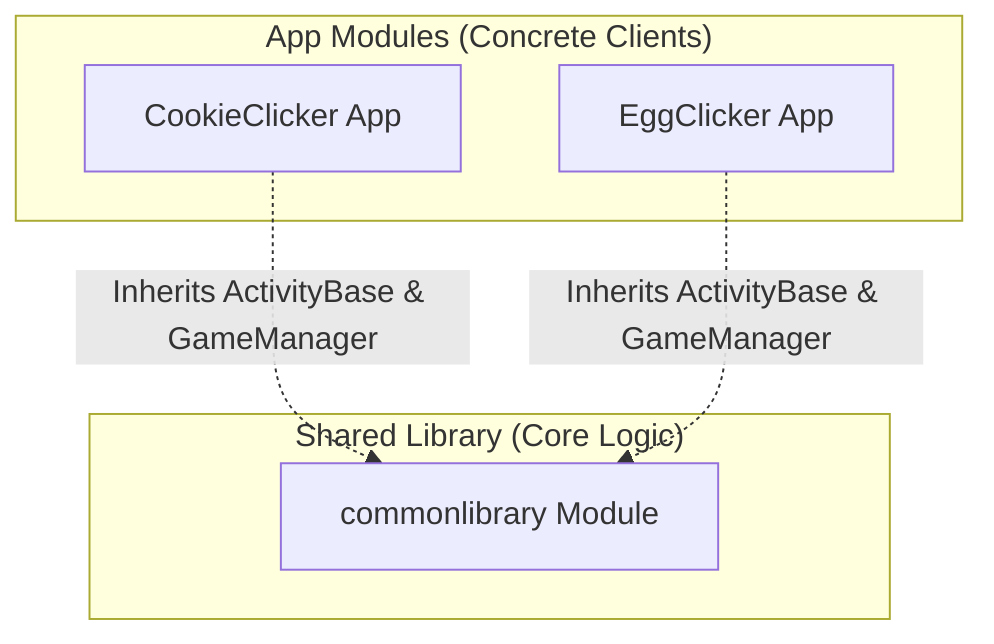

# Android Multi-Module Applications — Exercise 1

This project is a submission for **Exercise 1 (Multi-Module Apps)**. The goal of this assignment is to design a multi-module Android project where two distinct applications share a common module, specifically utilizing an **abstract base Activity** inside the shared library that both apps inherit from to reuse layout and logic.

---

## 🎓 Exercise Requirements & Implementation

The project strictly follows the professor's assignment guidelines and builds extensively beyond the baseline requirements:

| Assignment Requirement | Project Implementation |
| :--- | :--- |
| **Two applications using the same shared module** | Implemented **Cookie Clicker** (`:CookieClicker`) and **Egg Clicker** (`:EggClicker`) as two separate app modules referencing a single `:commonlibrary` module. |
| **Shared module contains an abstract Activity** | Implemented `ActivityBase` inside `:commonlibrary` as an `abstract class ActivityBase : AppCompatActivity()`. |
| **Activities in both apps inherit from the base abstract Activity** | `CookieActivity` and `EggActivity` inherit from `ActivityBase` and override configuration properties. |
| **Developed beyond the base requirements** | Implemented state-based game engines, resource mapping, haptic feedback, scalable precision math structures, and UI animations. |

---

## 🏗️ Project Architecture



### Module Breakdown

1.  **`:commonlibrary` (Android Library Module)**
    *   **`ActivityBase.kt`:** The abstract template activity. It inflates the shared layout, manages listeners, handles UI updates, triggers animations, and handles audio/vibration feedback.
    *   **`GameManager.kt`:** A dedicated state controller that encapsulates the clicker logic (score increments, upgrades, price scaling), keeping the activity classes decoupled from game state operations.
    *   **`BigNum` Utilities:** Custom classes (`BigNum`, `BigNumFormat`, `BigNumFormatter`) to support extremely large numbers (up to $10^{18}$ and beyond) standard double/long values cannot handle without overflowing, formatting them cleanly into suffixes (e.g. `10.00 M`, `1.50 B`) or scientific notation.
    *   **`SingleSoundPlayer.kt`:** Helper utility to handle game sound-effects playbacks cleanly.
2.  **`:CookieClicker` (Android Application Module)**
    *   Implements the **Cookie Clicker** theme.
    *   `CookieActivity.kt` inherits from `ActivityBase`, defining cookie-themed assets, sound-effects, and upgrade multipliers.
3.  **`:EggClicker` (Android Application Module)**
    *   Implements the **Egg Clicker** theme.
    *   `EggActivity.kt` inherits from `ActivityBase`, defining egg/coop-themed assets, sound-effects, and upgrade multipliers.

---

## 🚀 Going "Beyond the Requirements"

To demonstrate advanced software design, the following extensions were developed beyond a simple UI-wrapper:

### 1. Abstract Template Method Pattern
The base `ActivityBase` is not just an open layout wrapper; it defines a strict template contract. The subclasses specify their gameplay rules declaratively by overriding abstract properties:
```kotlin
abstract class ActivityBase : AppCompatActivity() {
    abstract var sound: Int
    abstract fun getAppTitle(): String
    abstract fun getUpgradeLabel(): String
    abstract fun getScoreIncrement(): BigNum
    abstract fun getStartingUpgradePrice(): BigNum
    abstract fun getMilestones(): List<VisualMilestone>
}
```

### 2. Decoupled Architecture
*   Instead of bloat in the Activity classes, game progression is managed by a separate class (`GameManager`) inside the library.
*   **Asset Resource Passing:** Subclass activities pass their local resource IDs (e.g., `R.drawable.cookie_1_dough` or `R.raw.egg_sound`) into the library's base template via a `VisualMilestone` list structure. This allows the shared layout to cleanly load client resources at runtime.

### 3. Polish & User Experience
*   **Micro-Animations:** Added scale-animations when clicking the interactive game object, label scale pulses on score updates, and fade animations on buttons when upgrades become affordable.
*   **Tactile Feedback:** Uses Android's `HapticFeedbackConstants` to provide tactile vibrations upon clicks.
*   **Audio Integration:** Playbacks of game-clicks utilize a sound pool structure to avoid latency.

---

## 🛠️ Build & Installation

### Build Commands
Using the Gradle wrapper:

```bash
# Compile and build both debug APKs
./gradlew assembleDebug

# Deploy Cookie Clicker
adb install -r CookieClicker/build/outputs/apk/debug/CookieClicker-debug.apk
adb shell am start -n com.example.moduleex1/com.example.moduleex1.CookieActivity

# Deploy Egg Clicker
adb install -r EggClicker/build/outputs/apk/debug/EggClicker-debug.apk
adb shell am start -n com.example.eggclicker/com.example.eggclicker.EggActivity
```
